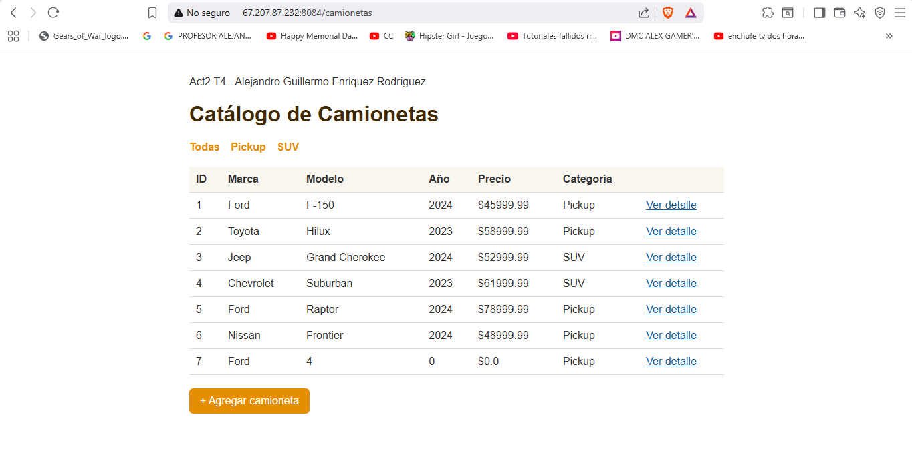
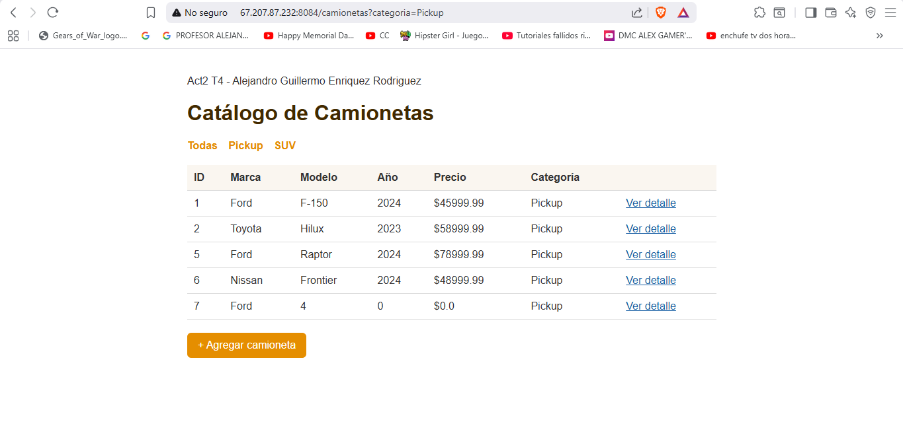
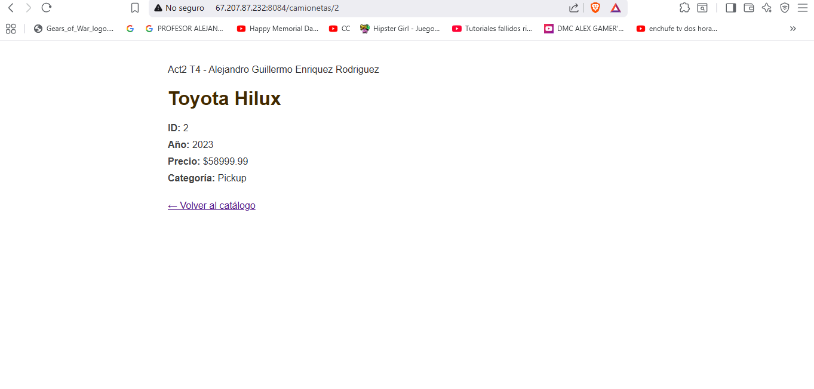
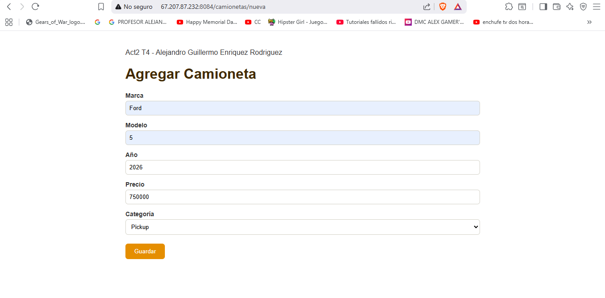
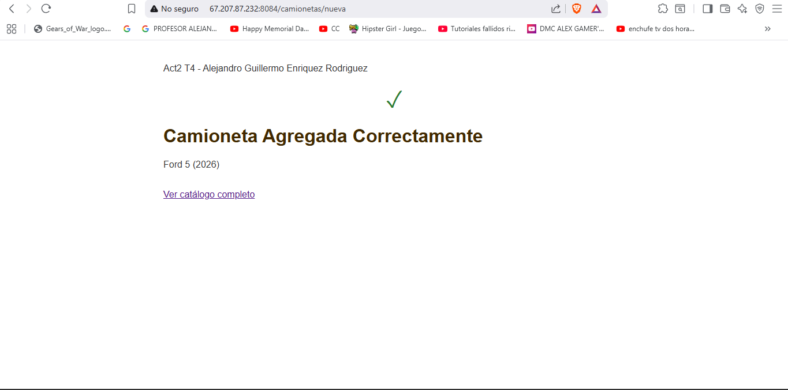
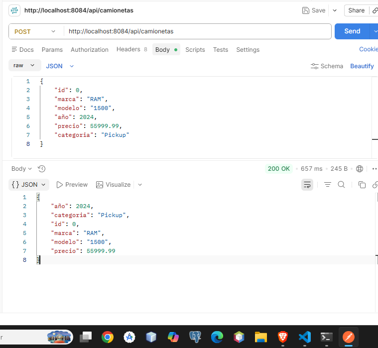

<div align="center">

# Instituto Tecnológico Nacional de México

### Instituto Tecnológico de Oaxaca

**Carrera:** Ingeniería en Sistemas Computacionales <br><br>
**Materia:** Programación Web<br><br>
**Actividad:** Act2. Spring MVC — Vistas con Thymeleaf, DTOs y Manejo de Peticiones <br><br>
**Docente:** Adelina Martínez Nieto<br><br>
**Integrante:** Enríquez Rodríguez Alejandro Guillermo<br><br>
**Fecha de entrega:** 17 de julio del 2026<br><br>

</div>

# Act2 T4 — Spring MVC con Thymeleaf

## Descripción del proyecto

Este proyecto es una copia de mi Actividad 1 (`ERAGact1_t4`), construida sobre esa misma base pero agregando vistas del lado del servidor con Thymeleaf, un DTO, manejo de parámetros con `@RequestParam` y `@PathVariable`, un formulario con `@ModelAttribute`, una propiedad externa leída con `@Value`, y un endpoint POST tipo REST probado con Postman.

El tema que elegí para el DTO fue **camionetas**, en vez del típico ejemplo de "producto".

## DTO

`CamionetaDTO` representa una camioneta con: id, marca, modelo, año, precio y categoría.

## Vistas y funcionalidades

### 1. Lista de camionetas (`th:each`)
Muestra todas las camionetas en una tabla, recorriéndolas con `th:each` desde el `Model`.



### 2. Filtro por categoría (`@RequestParam`)
El mismo endpoint de la lista acepta un parámetro opcional `categoria` para filtrar los resultados (por ejemplo, solo Pickup).



### 3. Detalle de una camioneta (`@PathVariable`)
Al hacer clic en "Ver detalle" desde la lista, se accede a la vista de una camioneta específica usando su id en la URL.



### 4. Formulario para agregar (`@ModelAttribute`)
Formulario que captura los datos de una camioneta nueva y los recibe en el controlador mediante `@ModelAttribute`.



Al guardar, se muestra una vista de confirmación:



### 5. Propiedad personalizada (`@Value`)
El nombre del proyecto se lee desde `application.properties` con `@Value("${proyecto.nombre}")` y se muestra en la parte superior de todas las vistas.

### 6. Endpoint POST tipo REST (`@RequestBody`)
Endpoint que recibe un JSON con los datos de una camioneta y lo regresa como confirmación, probado con Postman.

**Ruta:** `POST /api/camionetas`



## Documentación técnica

### Patrón MVC en este proyecto
- **Modelo:** la clase `CamionetaDTO`, que representa los datos de una camioneta.
- **Vista:** los archivos HTML con Thymeleaf (`camionetas.html`, `detalle.html`, `formulario.html`, `confirmacion.html`).
- **Controlador:** `CamionetaController`, que recibe las peticiones, prepara los datos en el `Model` y decide qué vista regresar.

### `@ModelAttribute` vs `@RequestBody`
- `@ModelAttribute` recibe datos de un formulario HTML normal (enviados como `application/x-www-form-urlencoded`), y los mapea a los campos del objeto por nombre.
- `@RequestBody` recibe un JSON directo en el cuerpo de la petición, y Spring lo convierte automáticamente al objeto Java correspondiente. Se usa en endpoints tipo API/REST, como el que probé en Postman.

### Puertos usados
- Actividad 1: puerto **8082** (sigue corriendo sin cambios).
- Actividad 2: puerto **8084**, para no chocar con la Actividad 1 en el mismo VPS.

---

## Estructura del proyecto

```
ERAGact2_t4/
├── pom.xml
├── screenshots/
├── src/
│   ├── main/
│   │   ├── java/com/enriquez/act1t4/
│   │   │   ├── Act1t4Application.java
│   │   │   ├── controllers/
│   │   │   │   ├── CamionetaController.java
│   │   │   │   └── CamionetaRestController.java
│   │   │   └── models/dto/
│   │   │       └── CamionetaDTO.java
│   │   └── resources/
│   │       ├── application.properties
│   │       ├── static/css/estilos.css
│   │       └── templates/
│   │           ├── camionetas.html
│   │           ├── detalle.html
│   │           ├── formulario.html
│   │           └── confirmacion.html
│   └── test/
└── README.md
```

---

## Tecnologías utilizadas

- **Java 21**
- **Spring Boot** (Spring MVC + Thymeleaf)
- **Maven**
- **Postman** — pruebas del endpoint POST
- **Git / GitHub**

---

## Ver en vivo

🔗 **Repositorio (Actividad 2):** https://github.com/AlejandroGuillermo7/ERAGact2_t4

🔗 **Proyecto en el VPS (Actividad 2, puerto 8084):**
- http://67.207.87.232:8084/camionetas
- http://67.207.87.232:8084/camionetas?categoria=Pickup
- http://67.207.87.232:8084/camionetas/1

🔗 **Actividad 1, sigue corriendo sin cambios (puerto 8082):**
http://67.207.87.232:8082/alumno
http://67.207.87.232:8082/materias
http://67.207.87.232:8082/identificacion

---

## Autor

**Alejandro Guillermo Enríquez Rodríguez**
Estudiante de Ingeniería en Sistemas Computacionales — Instituto Tecnológico de Oaxaca